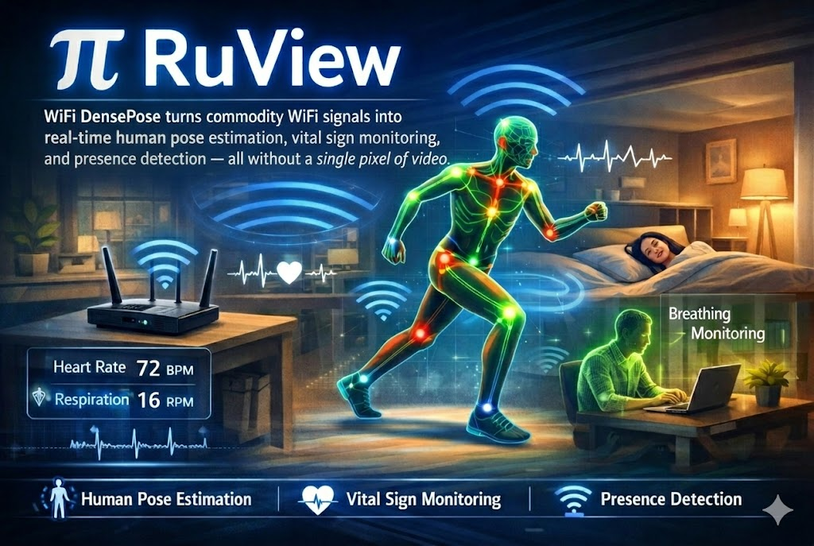
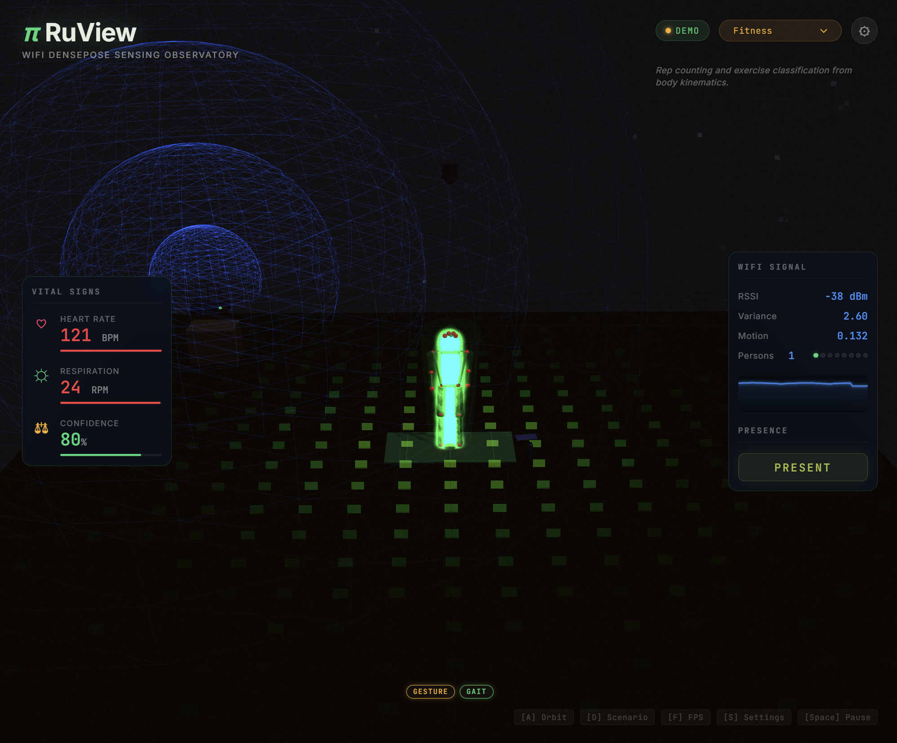

# π RuView

<p align="center">
  <a href="https://x.com/rUv/status/2037556932802761004">
    
  </a>
</p>

> **Beta Software** — Under active development. APIs and firmware may change. Known limitations:
> - ESP32-C3 and original ESP32 are not supported (single-core, insufficient for CSI DSP)
> - Single ESP32 deployments have limited spatial resolution — use 2+ nodes or add a [Cognitum Seed](https://cognitum.one) for best results
> - Camera-free pose accuracy is limited (PCK@20 ≈ 2.5% with proxy labels) — [camera ground-truth training](docs/adr/ADR-079-camera-ground-truth-training.md) targets **35%+ PCK@20**; the pipeline is implemented, but the data-collection and evaluation phases (ADR-079 P7–P9) are still pending, so no measured camera-supervised PCK@20 has been published yet
>
> Contributions and bug reports welcome at [Issues](https://github.com/ruvnet/RuView/issues).

## **See through walls with WiFi** ##

**Turn ordinary WiFi into a spatial intelligence / sensing system.** Detect people, measure breathing and heart rate, track movement, and monitor rooms — through walls, in the dark, with no cameras or wearables. Just physics.

### π RuView is a WiFi sensing platform that turns radio signals into spatial intelligence.

Every WiFi router already fills your space with radio waves. When people move, breathe, or even sit still, they disturb those waves in measurable ways. RuView captures these disturbances using Channel State Information (CSI) from low-cost ESP32 sensors and turns them into actionable data: who's there, what they're doing, and whether they're okay.

**What it senses:**
- **Presence and occupancy** — detect people through walls, count them, track entries and exits
- **Vital signs** — breathing rate and heart rate, contactless, while sleeping or sitting
- **Activity recognition** — walking, sitting, gestures, falls — from temporal CSI patterns
- **Environment mapping** — RF fingerprinting identifies rooms, detects moved furniture, spots new objects
- **Sleep quality** — overnight monitoring with sleep stage classification and apnea screening

Built on [RuVector](https://github.com/ruvnet/ruvector/) and [Cognitum Seed](https://cognitum.one), RuView runs entirely on edge hardware — an ESP32 mesh (as low as $9 per node) paired with a Cognitum Seed for persistent memory, cryptographic attestation, and AI integration. No cloud, no cameras, no internet required.

The system learns each environment locally using spiking neural networks that adapt in under 30 seconds, with multi-frequency mesh scanning across 6 WiFi channels that uses your neighbors' routers as free radar illuminators. Every measurement is cryptographically attested via an Ed25519 witness chain.

RuView also supports pose estimation (17 COCO keypoints via the WiFlow architecture), trained entirely without cameras using 10 sensor signals — a technique pioneered from the original *DensePose From WiFi* research at Carnegie Mellon University.

### Built for low-power edge applications

[Edge modules](docs/use-cases.md) are small programs that run directly on the ESP32 sensor — no internet needed, no cloud fees, instant response.

[](https://www.rust-lang.org/)
[](https://opensource.org/licenses/MIT)
[](https://github.com/ruvnet/RuView)
[](https://hub.docker.com/r/ruvnet/wifi-densepose)
[](docs/use-cases.md)
[](docs/use-cases.md)
[](https://crates.io/crates/wifi-densepose-ruvector)

 
> | What | How | Speed |
> |------|-----|-------|
> | 🦴 **Pose estimation** | CSI subcarrier amplitude/phase → 17 COCO keypoints | 171K emb/s (M4 Pro) |
> | 🫁 **Breathing detection** | Bandpass 0.1-0.5 Hz → zero-crossing BPM | 6-30 BPM |
> | 💓 **Heart rate** | Bandpass 0.8-2.0 Hz → zero-crossing BPM | 40-120 BPM |
> | 👤 **Presence sensing** | Trained model + PIR fusion — 100% accuracy | 0.012 ms latency |
> | 🧱 **Through-wall** | Fresnel zone geometry + multipath modeling | Up to 5m depth |
> | 🧠 **Edge intelligence** | 8-dim feature vectors + RVF store on Cognitum Seed | $140 total BOM |
> | 🎯 **Camera-free training** | 10 sensor signals, no labels needed | 84s on M4 Pro |
> | 📷 **Camera-supervised training** | MediaPipe + ESP32 CSI → **35%+ PCK@20 target** (ADR-079; eval phases pending) | ~19 min on laptop (pipeline) |
> | 📡 **Multi-frequency mesh** | Channel hopping across 6 bands, neighbor APs as illuminators | 3x sensing bandwidth |
> | 🌐 **3D point cloud** *(optional fusion)* | Camera depth (MiDaS) + WiFi CSI + mmWave radar → unified spatial model | 22 ms pipeline · 19K+ points/frame |

```bash
# Option 1: Docker (simulated data, no hardware needed)
docker pull ruvnet/wifi-densepose:latest
docker run -p 3000:3000 ruvnet/wifi-densepose:latest
# Open http://localhost:3000

# Option 2: Live sensing with ESP32-S3 hardware ($9)
# Flash firmware, provision WiFi, and start sensing:
python -m esptool --chip esp32s3 --port COM9 --baud 460800 \
  write_flash 0x0 bootloader.bin 0x8000 partition-table.bin \
  0xf000 ota_data_initial.bin 0x20000 esp32-csi-node.bin
python firmware/esp32-csi-node/provision.py --port COM9 \
  --ssid "YourWiFi" --password "secret" --target-ip 192.168.1.20

# Option 3: Full system with Cognitum Seed ($140)
# ESP32 streams CSI → bridge forwards to Seed for persistent storage + kNN + witness chain
node scripts/rf-scan.js --port 5006           # Live RF room scan
node scripts/snn-csi-processor.js --port 5006  # SNN real-time learning
node scripts/mincut-person-counter.js --port 5006  # Correct person counting
```

> [!NOTE]
> **CSI-capable hardware recommended.** Presence, vital signs, through-wall sensing, and all advanced capabilities require Channel State Information (CSI) from an ESP32-S3 ($9) or research NIC. The Docker image runs with simulated data for evaluation. Consumer WiFi laptops provide RSSI-only presence detection.

> **Hardware options** for live CSI capture:
>
> | Option | Hardware | Cost | Full CSI | Capabilities |
> |--------|----------|------|----------|-------------|
> | **ESP32 + Cognitum Seed** (recommended) | ESP32-S3 + [Cognitum Seed](https://cognitum.one) | ~$140 | Yes | Pose, breathing, heartbeat, motion, presence + persistent vector store, kNN search, witness chain, MCP proxy |
> | **ESP32 Mesh** | 3-6x ESP32-S3 + WiFi router | ~$54 | Yes | Pose, breathing, heartbeat, motion, presence |
> | **Research NIC** | Intel 5300 / Atheros AR9580 | ~$50-100 | Yes | Full CSI with 3x3 MIMO |
> | **Any WiFi** | Windows, macOS, or Linux laptop | $0 | No | RSSI-only: coarse presence and motion |
>
> No hardware? Verify the signal processing pipeline with the deterministic reference signal: `python archive/v1/data/proof/verify.py`
>
---

  <a href="https://ruvnet.github.io/RuView/">
    
  </a>
  <br>
  <em>Real-time pose skeleton from WiFi CSI signals — no cameras, no wearables</em>
  <br><br>
  <a href="https://ruvnet.github.io/RuView/"><strong>▶ Live Observatory Demo</strong></a>
  &nbsp;|&nbsp;
  <a href="https://ruvnet.github.io/RuView/pose-fusion.html"><strong>▶ Dual-Modal Pose Fusion Demo</strong></a>
  &nbsp;|&nbsp;
  <a href="https://ruvnet.github.io/RuView/pointcloud/"><strong>▶ Live 3D Point Cloud</strong></a>

> The [server](docs/dev-handbook.md) is optional for visualization and aggregation — the ESP32 [runs independently](docs/architecture.md) for presence detection, vital signs, and fall alerts.
>
> **Live ESP32 pipeline**: Connect an ESP32-S3 node → run the [sensing server](docs/dev-handbook.md) → open the [pose fusion demo](https://ruvnet.github.io/RuView/pose-fusion.html) for real-time dual-modal pose estimation (webcam + WiFi CSI). See [ADR-059](docs/adr/ADR-059-live-esp32-csi-pipeline.md).

## 🔬 How It Works

WiFi routers flood every room with radio waves. RuView's ESP32 mesh
captures CSI from those waves, fuses it across channels and nodes, and
feeds a coherence-gated signal pipeline into an attention-graph neural
network that outputs pose keypoints, vital signs, and room fingerprints.

→ **Full pipeline diagram + module-by-module breakdown:**
  [`docs/architecture.md`](docs/architecture.md)

---

## 🏢 Use Cases & Applications

RuView serves four deployment tiers: **Everyday** (healthcare, retail,
office), **Specialized** (events, fitness, education), **Robotics &
Industrial** (cobots, AMRs, manufacturing) and **Extreme** (search &
rescue, defense, underground). Each one comes with a concrete hardware
BOM, expected accuracy, and pointer to the matching ADR-041 edge module.

Also covers the [Self-Learning WiFi AI (ADR-024)](docs/adr/ADR-024-contrastive-csi-embedding-model.md)
(128-dim fingerprint, 55 KB on ESP32) and the full 60-module ADR-041
Edge Intelligence catalogue.

→ **Full catalogue + tables: [`docs/use-cases.md`](docs/use-cases.md)**

---

## 🧩 Claude Code & Codex Plugin

RuView ships a [Claude Code](https://docs.anthropic.com/en/docs/claude-code) plugin (and Codex prompt mirror) that wraps the whole workflow — onboarding, ESP32 setup, configuration, sensing apps, model training, advanced multistatic sensing, CLI/API/WASM, mmWave radar, and witness verification — as 9 skills, 7 `/ruview-*` commands, and 3 agents. It lives in [`plugins/ruview/`](plugins/ruview/README.md); the marketplace manifest is [`.claude-plugin/marketplace.json`](.claude-plugin/marketplace.json) at the repo root.

```bash
# In Claude Code — add this repo as a plugin marketplace, then install:
/plugin marketplace add ruvnet/RuView
/plugin install ruview@ruview

# Or try it for one session without installing (from a local clone of the repo):
claude --plugin-dir ./plugins/ruview

# Then, in Claude Code:
#   /ruview-start      → onboarding (Docker demo / repo build / live ESP32)
#   /ruview-flash      → build + flash ESP32 firmware
#   /ruview-provision  → provision WiFi creds, sink IP, channel/MAC, mesh slots
#   /ruview-app        → run a sensing application (presence / vitals / pose / sleep / MAT / point cloud)
#   /ruview-train      → train / evaluate / publish a model (incl. GPU on GCloud)
#   /ruview-advanced   → multistatic / tomography / cross-viewpoint / mesh-security
#   /ruview-verify     → tests + deterministic proof + witness bundle
```

**Codex (OpenAI CLI):** `cp plugins/ruview/codex/prompts/*.md ~/.codex/prompts/` — the seven `/ruview-*` commands are mirrored as Codex prompts; [`plugins/ruview/codex/AGENTS.md`](plugins/ruview/codex/AGENTS.md) carries the project rules. See [`plugins/ruview/codex/README.md`](plugins/ruview/codex/README.md).

Verify the plugin structure: `bash plugins/ruview/scripts/smoke.sh`. Full details: [`plugins/ruview/README.md`](plugins/ruview/README.md).

---

## 📖 Documentation

| Document | Description |
|----------|-------------|
| [User Guide](docs/user-guide.md) | Step-by-step guide: installation, first run, API usage, hardware setup, training |
| [Build Guide](docs/build-guide.md) | Building from source (Rust and Python) |
| [Claude Code / Codex Plugin](plugins/ruview/README.md) | The `ruview` plugin + marketplace — skills, `/ruview-*` commands, agents, and the Codex prompt mirror |
| [Architecture Decisions](docs/adr/README.md) | 96 ADRs — why each technical choice was made, organized by domain (hardware, signal processing, ML, platform, infrastructure) |
| [Domain Models](docs/ddd/README.md) | 8 DDD models (RuvSense, Signal Processing, Training Pipeline, Hardware Platform, Sensing Server, WiFi-Mat, CHCI, rvCSI) — bounded contexts, aggregates, domain events, and ubiquitous language |
| [rvCSI — edge RF sensing runtime](https://github.com/ruvnet/rvcsi) | Rust-first / TypeScript-accessible / hardware-abstracted CSI runtime: multi-source ingestion (incl. real nexmon_csi `.pcap` from a **Raspberry Pi 5** / Pi 4 / Pi 3B+ — CYW43455 / BCM43455c0) → validation → DSP → typed events → RuVector RF memory ([ADR-095](docs/adr/ADR-095-rvcsi-edge-rf-sensing-platform.md), [ADR-096](docs/adr/ADR-096-rvcsi-ffi-crate-layout.md), [domain model](docs/ddd/rvcsi-domain-model.md)). Now its own repo — [`ruvnet/rvcsi`](https://github.com/ruvnet/rvcsi) — vendored here under `vendor/rvcsi`; 9 `rvcsi-*` crates on crates.io, `@ruv/rvcsi` on npm, plus a Claude Code plugin. |
| [Desktop App](v2/crates/wifi-densepose-desktop/README.md) | **WIP** — Tauri v2 desktop app for node management, OTA updates, WASM deployment, and mesh visualization |
| [Medical Examples](examples/medical/README.md) | Contactless blood pressure, heart rate, breathing rate via 60 GHz mmWave radar — $15 hardware, no wearable |
| [Extended Documentation](docs/readme-details.md) | Latest additions, key features, installation, quick start, signal processing, training, CLI, testing, deployment, and changelog |

---

## 📄 License

MIT License — see [LICENSE](LICENSE) for details.

## 📞 Support

[GitHub Issues](https://github.com/ruvnet/RuView/issues) | [Discussions](https://github.com/ruvnet/RuView/discussions) | [PyPI](https://pypi.org/project/wifi-densepose/)

---

**WiFi DensePose** — Privacy-preserving human pose estimation through WiFi signals.
